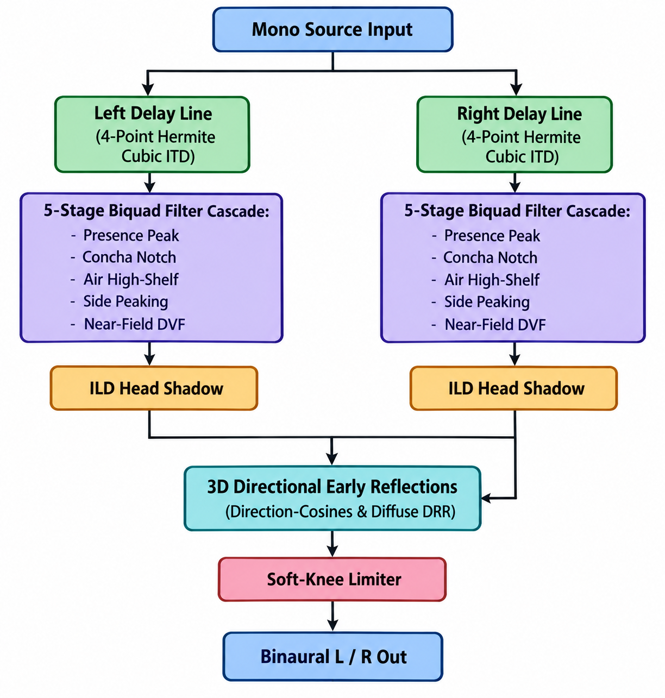
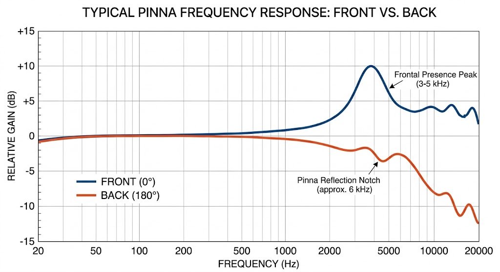

# Rotating HRTF v2 Audio Plugin (CLAP + VST3 for Ableton Live)

A high-performance, real-time 3D binaural spatialiser audio plugin built upon an acoustically calibrated Head-Related Transfer Function (HRTF) DSP core. It simulates spherical head acoustic shadow, interaural time delays, distance attenuation, near-field curvature divergence, anthropometric pinna and skull scaling, and room boundary reflections for headphones and stereo monitoring.

Developed in pure C (core DSP engine, CLAP plugin, standalone CLI generator, and dogfooding test harness) with a minimal C++17 VST3 wrapper strictly for Ableton Live compatibility. Fully self-contained native C and C++ architecture built using standard MSVC tools.

Published by **psipi** (CLAP ID `psipi.hrtf`). Current release: **v2.0.1**.

---

## Table of Contents

1. [Features & Capabilities](#features--capabilities)
2. [Acoustic & DSP Foundations](#acoustic--dsp-foundations)
3. [Plugin Formats](#plugin-formats)
4. [Parameters Reference](#parameters-reference)
5. [Ableton Live Integration Guide](#ableton-live-integration-guide)
6. [Test Signal Generator CLI](#test-signal-generator-cli)
7. [Automated Verification & Test Harness](#automated-verification--test-harness)
8. [Building from Source](#building-from-source)
9. [Project Architecture](#project-architecture)

---

## Features & Capabilities

- **Binaural 3D Positioning**: Full $360^\circ$ horizontal azimuth rotation and $-90^\circ$ to $+90^\circ$ vertical elevation.
- **Calibrated Output Level**: At the default position ($2\text{ m}$, front) the output sits $2\text{ dB}$ below the input. Further away it falls by the $1/d$ inverse-distance law ($-6\text{ dB}$ per doubling); closer in it rises gently towards a ceiling, and no ear is ever louder than the input, in any direction or at any setting.
- **Logarithmic Distance Control**: Every doubling of distance takes the same knob travel, so $5\text{ cm}$ to $1\text{ m}$ is half the range.
- **Distance Variation Function (DVF)**: Near-field wavefront curvature produces up to $9.5\text{ dB}$ of low-frequency Interaural Level Difference (ILD) divergence at $5\text{ cm}$.
- **Woodworth Spherical Ray-Tracing ITD**: Physical spherical head acoustic ray-tracing model with 4-point Hermite cubic fractional delay interpolation (within $0.6\text{ dB}$ of flat up to $10\text{ kHz}$ at any angle).
- **Frequency-Dependent Cranial Head Shadow**: Differentiates low-frequency spherical diffraction ($-4\text{ dB}$ LF shadow) from deep high-frequency shadowing (up to $-13\text{ dB}$ HF shadow).
- **3D Directional Room Boundaries & Distance-Dependent DRR**: Early reflections dynamically modulated by source direction cosines $(s, c, v)$ and decoupled from direct sound to establish an authentic Direct-to-Reverberant Ratio gradient with distance. **Space** is loudness-neutral (it changes the direct/room balance, not the level) and a **Reflections** switch fades the whole room out and back in without losing the Space setting.
- **Anthropometric Head & Pinna Scaling**: Adjust head circumference and ear dimensions from $70\%$ to $130\%$, scaling ITD time delays and shifting spectral pinna notch frequencies accordingly.
- **Integrated Psychoacoustic Test Pulse Generator**: Built-in tick-box generator synthesising tempo-aligned pulsed pink noise across a morphable low-rumble to crisp-transient timbre continuum (with additional sine and Dirac click impulse modes available in the CLI synthesis tool). Its edges are click-free: starting playback in the middle of a pulse ramps in like the pulse's own attack, and switching the pulse on or off crossfades over $5\text{ ms}$.
- **Sample-Accurate Automation**: VST3 and CLAP parameter changes take effect at their exact sample offsets within the block, and the render is bit-identical whatever block size the host uses.

---

## Acoustic & DSP Foundations





### 1. Coordinate System & Direction Cosines
Positions are calculated using spherical coordinate conventions:
- $\theta$: Azimuth phase $[0, 1)$ corresponding to $[0^\circ, 360^\circ)$ ($0^\circ = \text{front}$, $90^\circ = \text{right}$, $180^\circ = \text{rear}$, $270^\circ = \text{left}$).
- $\phi$: Elevation angle $[-90^\circ, +90^\circ]$ ($-90^\circ = \text{below}$, $0^\circ = \text{horizontal}$, $+90^\circ = \text{overhead}$).
- Direction cosines:
  - $s = \cos\phi \sin\theta$ (Lateral projection: $-1 = \text{left}$, $+1 = \text{right}$)
  - $c = \cos\phi \cos\theta$ (Front/Rear projection: $+1 = \text{front}$, $-1 = \text{rear}$)
  - $v = \sin\phi$ (Vertical projection: $+1 = \text{overhead}$, $-1 = \text{below}$)

### 2. Interaural Time Difference (ITD)
Calculated via Woodworth's spherical head acoustic ray-tracing model coupled with 4-point Hermite cubic fractional delay interpolation:

$$
\text{scale}_{\text{woodworth}}(\theta) = \frac{\sin\theta_{\text{lat}} + \theta_{\text{lat}}}{1.0 + \frac{\pi}{2}}
$$

$$
\text{ITD}(s, d, \alpha) = \text{ITD}_{\max} \cdot \text{scale}_{\text{woodworth}}(\theta) \cdot \text{scale}_{\text{nf}}(d) \cdot \alpha
$$

where:
- $\text{ITD}_{\max} = 0.70\text{ ms}$ (`HRTF_MAX_ITD_S`, reference cranial diameter).
- $\theta_{\text{lat}} = \arcsin(|s|)$ represents the lateral incident angle, eliminating the $\sim 0.12\text{ ms}$ over-estimate of sinusoidal models at intermediate angles ($30^\circ\text{--}60^\circ$).
- 4-point Hermite cubic spline interpolation keeps the far-ear passband close to flat: at the worst case (a half-sample fractional delay at $48\text{ kHz}$) it is $-0.5\text{ dB}$ at $10\text{ kHz}$, $-2.5\text{ dB}$ at $15\text{ kHz}$ and $-8.4\text{ dB}$ at $20\text{ kHz}$, far better than linear interpolation. Integer delays, including the near ear, are exact.
- $\text{scale}_{\text{nf}}(d) = 1.0 + \left(\frac{0.00765}{2 d^2 + 0.00765} - \text{offset}\right)$ (`nf_itd_scale`) accounts for spherical wavefront curvature increase at distances $d < 1\text{ m}$, continuous at $1\text{ m}$.
- $\alpha \in [0.70, 1.30]$ is the anthropometric **Ear Scale** parameter.

### 3. Frequency-Dependent Interaural Level Difference (ILD)
Head shadow models frequency-dependent diffraction around the cranial sphere:
- **Low-Frequency Cranial Diffraction**: Sounds below $500\text{ Hz}$ bend around the skull with modest loss (broadband contralateral shadow of $-4.0\text{ dB}$, $g_{\text{far}} = 0.6310$).
- **Contralateral High-Frequency Shadow**: The pinna/air high-shelf cascade introduces an additional $-9.0\text{ dB}$ attenuation on the far ear (totaling $-13.0\text{ dB}$ HF shadow), accurately matching measured human HRIRs.
- **Energy-Balanced Normalisation**: Ipsilateral and contralateral gains are normalised to maintain acoustic energy balance:

$$
g_L = 1 - s(1 - g_{\text{far}}), \quad g_R = 1, \quad g_{\text{norm}} = \sqrt{\frac{g_L^2 + g_R^2}{2}}
$$

### 4. Anthropometric Pinna Spectral Cues
Five cascading biquad filters in transposed direct-form II dynamically shape frequency content based on orientation and scale factor $\alpha$:
- **Presence Resonance Peak**: Centred at $f = 3900\text{ Hz} / \alpha$, boosting up to $+6\text{ dB}$ for frontal sources to provide clarity and front-image definition.
- **Dynamic Concha Notch**: Median-plane elevation notch providing pinna attenuation shifting between $3.5\text{ kHz}$ (below, $v=-1$) and $9.5\text{ kHz}$ (overhead, $v=+1$), scaled by $\alpha$:

$$
f_{\text{notch}} = \frac{6500 + 3000 v}{\alpha}
$$

- **High-Frequency Air Shelf**: Cutoff at $8500\text{ Hz} / \alpha$, progressively attenuating rearward and overhead sources.
- **Lateral Pinna Asymmetry**: Peaking filter at $2200\text{ Hz} / \alpha$, differentiating lateral positions from standard intensity panning.
- **Near-Field Low-Frequency ILD Divergence (DVF)**: Low-shelf filter at $350\text{ Hz} / \alpha$ delivering up to $9.5\text{ dB}$ of low-frequency ILD divergence for sources within $1\text{ metre}$, applied as a cut on the far ear so the near ear is never pushed above the calibrated output level.

### 5. 3D Directional Room Boundaries & Distance-Dependent DRR
A circular buffer models early reflections from five boundary surfaces:
- Floor ($4.8\text{ ms}$, modulated by vertical projection $v$)
- Ceiling ($8.1\text{ ms}$, modulated by vertical projection $v$)
- Left wall ($14.0\text{ ms}$ to the left ear, $14.65\text{ ms}$ to the right ear, modulated by lateral projection $s$)
- Right wall ($14.0\text{ ms}$ to the right ear, $14.65\text{ ms}$ to the left ear, modulated by lateral projection $s$)
- Back wall ($23.4\text{ ms}$, modulated by front/rear projection $c$)

Reflection delays are fractional and glide continuously as the source rotates or the ear scale changes, so automation never steps a tap by a whole sample. Reflections exhibit acoustic ILD at the ears and pass through a 1-pole high-frequency wall absorption filter (corner $\approx 8\text{ kHz}$, independent of sample rate). Rather than scaling with direct inverse distance, room reflections scale with a diffuse room factor $\frac{1}{\sqrt{1 + 0.15 d}}$, establishing a realistic Direct-to-Reverberant Ratio (DRR) gradient that serves as the primary acoustic distance cue.

**Space** sets how much room is heard and is loudness-neutral: the direct and room paths are re-balanced so the overall level stays on the distance curve (below). The **Reflections** switch fades the room out, and back in, over about $20\text{ ms}$ while keeping the Space amount, for quick A/B comparisons; Reflections Off renders exactly like Space $0\%$.

### 6. Output Level, Distance Curve & Soft-Knee Saturation
- **Anchor**: Pink noise at the default position ($2\text{ m}$, front, $15\%$ Space) comes out $2.0\text{ dB}$ below the input.
- **Beyond 2 m**: The level follows the $1/d$ inverse-distance law from that anchor: about $-8\text{ dB}$ at $4\text{ m}$, $-14\text{ dB}$ at $8\text{ m}$ and $-22\text{ dB}$ at $20\text{ m}$ (front, relative to the input).
- **Closer than 2 m**: The level rises smoothly (the slope is continuous at $2\text{ m}$) into a ceiling. Frontal sources reach about $-1.1\text{ dB}$ at $5\text{ cm}$ including the near-field presence lift.
- **Never louder than the input**: The master gain and the near-field ceiling were measured with long pink-noise runs over distance, azimuth, elevation, Ear Scale and Space, and no ear exceeds the input level anywhere (the worst case, $5\text{ cm}$ at $45^\circ$ with $130\%$ Ear Scale and $100\%$ Space, sits about $0.35\text{ dB}$ below it). The distance-to-reverberant balance is kept exactly as the physical model gives it, so the room gets quieter relative to the direct sound as a source approaches. This is a broadband guarantee: a sustained pure tone parked on the $\approx 4\text{ kHz}$ frontal presence resonance can read a few dB above its input, because that is the pinna boost itself.
- **Tanh Soft-Knee Saturation**: Soft knee engaging above $-1.0\text{ dBFS}$ ($0.89125$), guaranteeing peak output never exceeds $0\text{ dBFS}$. With the output this close to unity, sustained tones peaking at $-8\text{ dBFS}$ stay well below the knee even in the worst geometry; hotter material landing on a filter boost is caught by the limiter.
- **Hostile Input**: Non-finite input samples (NaN or infinity) are replaced with silence before they can latch the recursive filters.

---

## Plugin Formats

### 1. VST3 (`RotatingHRTF_v2.vst3`)
- **Compatibility**: Built for Ableton Live 10.1+, Cubase, Studio One, Reaper and other VST3 hosts on Windows x64. Passes the Steinberg VST3 SDK validator (47 of 47 tests).
- **Channel Configurations**:
  - Stereo-in / Stereo-out (downmixes stereo track input to mono for true point-source spatialisation).
  - Mono-in / Stereo-out (native mono bus support).
- **Automation**: Full sample-accurate parameter automation.
- **Host Integration**: Requests tempo, musical position and transport state from the host (`IProcessContextRequirements`) and declares an infinite tail so hosts never suspend processing while the Test Pulse is generating from silence.
- **Runtime**: The C runtime is linked statically, so no Visual C++ redistributable is required.
- **Installation Directory**:
  ```
  C:\Program Files\Common Files\VST3\RotatingHRTF_v2.vst3\Contents\x86_64-win\RotatingHRTF_v2.vst3
  ```

### 2. CLAP (`RotatingHRTF_v2.clap`)
- **Compatibility**: Bitwig Studio, Reaper, FL Studio, and native CLAP hosts.
- **Channel Configuration**: Stereo-in / Stereo-out. Stereo input is downmixed to mono for true point-source spatialisation; a single-channel input buffer is also accepted.
- **Distance Parameter**: CLAP hosts draw and automate parameters linearly, so Distance is exposed as a $0$ to $1$ position on the logarithmic taper; its text reads and accepts metres (or `cm`).
- **Features**: Thread-safe parameter flush, sample-accurate in-process events, state extension, audio-ports extension, latency extension, transport synchronisation.

---

## Parameters Reference

| ID (VST3/CLAP) | Parameter | Display Name | VST3 Range & Units | CLAP Range & Units | Default | Description |
|---|---|---|---|---|---|---|
| `100` / `1` | `kParamDistance` | **Distance** | 0.05 – 20.0 m (logarithmic) | 0.0 – 1.0 position (shown in metres) | 2.0 m | Radial distance. $-2\text{ dB}$ at $2\text{ m}$, $1/d$ beyond, gentle rise to a ceiling closer in, with near-field DVF divergence. |
| `101` / `2` | `kParamRotation` | **Rotation** | 0.0 – 360.0 deg | 0.0 – 1.0 phase | 0.0 (front) | Horizontal azimuth angle ($0.25 = 90^\circ$ right, $0.5 = 180^\circ$ rear, $0.75 = 270^\circ$ left). |
| `102` / `3` | `kParamElevation` | **Elevation** | -90.0 – +90.0 deg | -90.0 – +90.0 deg | 0.0 deg | Vertical angle ($-90^\circ$ below, $0^\circ$ horizontal, $+90^\circ$ overhead). Modulates concha notches. |
| `103` / `4` | `kParamSpace` | **Space** | 0.0 – 100.0 % | 0.0 – 1.0 factor | 15.0 % (0.15) | Room boundary early reflection amount. Pulls perceived sound out of the skull without changing the overall level. |
| `104` / `5` | `kParamTestPulse` | **Test Pulse** | Off / On (0 / 1) | Off / On (0.0 / 1.0) | Off | Dedicated tick-box replacing track audio with tempo-synchronised test pulses. |
| `105` / `6` | `kParamTestTone` | **Test Tone** | 0.0 – 100.0 % | 0.0 – 1.0 factor | 50.0 % (0.50) | Timbre morphing: `0%` = sub-rumble, `50%` = calibrated pink noise, `100%` = crisp transient snap. |
| `106` / `7` | `kParamEarScale` | **Ear Scale** | 70.0 – 130.0 % | 0.70 – 1.30 factor | 100.0 % (1.00) | Anthropometric skull and pinna scale $\alpha$. Scales ITD delay and shifts notch frequencies ($f' = f / \alpha$). |
| `107` / `8` | `kParamReflections` | **Reflections** | Off / On (0 / 1) | Off / On (0.0 / 1.0) | On | Room bypass: fades the early reflections out (Off) or in (On) over about $20\text{ ms}$, keeping the Space amount. |

All continuous parameters feature exponential slewing ($20\text{ ms}$ to $50\text{ ms}$) in `hrtf_core.c`, the Reflections switch fades over $20\text{ ms}$ and the Test Pulse switch crossfades over $5\text{ ms}$, so automation is zipper-free and click-free during live playback.

---

## Ableton Live Integration Guide

### Automated 1-Click Install
Run [`install_ableton.bat`](install_ableton.bat). It self-elevates with Administrator permissions if necessary and deploys the binary into the standard Windows 64-bit VST3 bundle location:
```cmd
install_ableton.bat
```

### Manual Installation
```cmd
mkdir "C:\Program Files\Common Files\VST3\RotatingHRTF_v2.vst3\Contents\x86_64-win"
copy /y RotatingHRTF_v2.vst3 "C:\Program Files\Common Files\VST3\RotatingHRTF_v2.vst3\Contents\x86_64-win\"
```

### Loading in Ableton Live
1. Open Ableton Live **Preferences** (`Ctrl + ,`) -> **Plug-Ins**.
2. Turn **"Use VST3 Plug-In System Folders"** to **ON**.
3. Click **"Rescan Plug-ins"** (hold `Alt` while clicking for a deep rescan).
4. In Ableton's browser: navigate to **Plug-Ins** -> **VST3** -> **psipi** -> **Rotating HRTF v2**.
5. Drag the plugin onto any audio track or return track.
6. Check the **Test Pulse** box to immediately verify 3D rotation, elevation, and room externalisation with tempo-aligned pulses.

---

## Test Signal Generator CLI

### Standalone CLI Tool: `tools/generate_test_pulse.c`
A command-line tool directly linking with `hrtf_core.c` to generate psychoacoustically calibrated WAV files with exact DSP parity to the plugin.

#### Compilation:
```cmd
cl.exe /nologo /O2 /I. tools\generate_test_pulse.c hrtf_core.c /Fo:build\ /Fe:build\generate_test_pulse.exe
```

#### CLI Options:
```text
Rotating HRTF Test Pulse Generator (CLI)
Synthesises calibrated test signals for 3D HRTF spatialisation benchmarking.

Usage: generate_test_pulse [options]

Options:
  -o, --output <path>       Output WAV file path (default writes standard test files)
  -t, --tone <0.0..1.0>     Tone morphing: 0.0=low rumble, 0.5=pink noise, 1.0=crisp transient (default: 0.5)
  -m, --mode <mode>         Signal mode: noise, sine, click (default: noise)
  -f, --freq <Hz>           Sine test frequency in Hz (default: 1000.0)
  -b, --bpm <BPM>           Tempo in beats per minute (default: 120.0)
  -n, --beats <count>       Total number of beats to synthesise (default: 8)
  -d, --dur <ms>            Pulse duration in milliseconds (default: 200.0)
  -s, --samplerate <Hz>     Audio sample rate in Hz (default: 48000)
  -h, --help                Display this help message and exit
```

#### Examples:
```cmd
:: Generate standard 8-beat reference pink noise at 120 BPM
build\generate_test_pulse.exe -o test_signals\reference_pink.wav -t 0.5

:: Generate low-frequency rumble pulse for subwoofer/bass evaluation
build\generate_test_pulse.exe -o test_signals\sub_rumble.wav -t 0.0 -b 128 -n 4

:: Generate snappy Dirac click impulse for exact ITD delay inspection
build\generate_test_pulse.exe -o test_signals\impulse_clicks.wav -m click -b 120

:: Generate a 1 kHz sine burst pattern
build\generate_test_pulse.exe -o test_signals\sine_1k.wav -m sine -f 1000 -d 150
```

---

## Automated Verification & Test Harness

Every build executes comprehensive automated test binaries that thoroughly exercise the DSP engine, parameter automation, and edge cases:

### VST3 Test Suite (`test_vst3.cpp`)
- **Factory & Controller**: Validates COM class creation, parameter registration ($8$ parameters), and normalisation curves.
- **Distance Taper & Switches**: Verifies the logarithmic Distance mapping (mid-travel is exactly $1\text{ m}$, default $2\text{ m}$) and that Reflections defaults to On with Off/On labels.
- **Latency Reporting**: Verifies processor declares $2$ samples of latency (`getLatencySamples() == 2`) for PDC.
- **State Serialisation**: Verifies `getState()` and `setState()` full round-trip across all 8 parameters (68-byte state).
- **Hostile Stream Immutability**: Verifies rejection of truncated or invalid processor and controller state streams while asserting parameter and state immutability.
- **Mid-Session Rate Change & Rate-Specific ITD**: Validates mid-session sample rate changes up to $96\text{ kHz}$ with rate-specific ITD arrival index verification ($142 \pm 3$ samples at $96\text{ kHz}$, distinguishing from $48\text{ kHz}$).
- **Binaural Energy & ILD**: Verifies that lateral panning ($90^\circ$) produces over $1.5\times$ more energy in the ipsilateral ear than the contralateral ear.
- **Sample-Accurate Automation**: Verifies against an unchanged reference that changes at offsets $64$ and $192$ first alter the output at exactly those samples.
- **Tail & Process Context**: Verifies `getTailSamples() == kInfiniteTail` and that the processor requests tempo, musical position and transport state via `IProcessContextRequirements`.
- **Unrenderable Blocks**: Verifies that parameter changes sent with null output buffers are still applied.
- **Oversize Block Handling**: Confirms that blocks larger than `maxSamplesPerBlock` ($1024+$ samples) process correctly and produce valid audio.
- **3D Elevation Symmetry**: Verifies that overhead elevation ($+90^\circ$) yields symmetric left/right energy ($|L - R| < 1.0, L > 0.1$).
- **Test Pulse Generation & Silence**: Confirms that enabling `Test Pulse` on a silent input stream generates audio ($E > 1.0$), and disabling it produces silence.
- **Test Tone Differentiation**: Confirms significant spectral variance ($\Delta > 5.0$) between low rumble and crisp transient settings.
- **Ear Scale Response**: Verifies that varying `Ear Scale` from $70\%$ to $130\%$ produces substantial ITD delay and pinna notch shifts ($\Delta > 20.0$).
- **Null Buffer Immunity**: Asserts resilience against null input/output channel arrays.

### CLAP Test Suite (`test_clap.c`)
- **Lifecycle & Activation**: Tests `init()`, `activate()`, and `deactivate()`.
- **Latency Extension**: Verifies plugin declares $2$ samples of latency via `CLAP_EXT_LATENCY`.
- **Parameter Validation & Enumeration**: Tests parameter enumeration ($8$ parameters) and string conversions (validates exact `value_to_text` and `text_to_value` round-trip across all parameters).
- **State Serialisation Round-Trip**: Verifies that saving state to a stream and restoring it accurately preserves all 8 parameter values across sessions.
- **Hostile Stream Immutability & Rescan**: Rejects corrupted and truncated state streams (bad magic, invalid version 99, 6-byte truncated version, 3-byte truncated header, 24-byte payload) while asserting parameter immutability and host `rescan(CLAP_PARAM_RESCAN_VALUES)` notification.
- **Limiter Transparency & Active Overdrive**: Sustained $-8\text{ dBFS}$ sines ($1$, $2.5$, $3.9$ and $3.973\text{ kHz}$) at the worst-case geometry and a cold-start probe asserting peak $< 0.89125$ (about $23\%$ linear margin under the $-1.0\text{ dBFS}$ knee with the limiter idle), plus active $+6\text{ dBFS}$ overdrive verification asserting peak $> 0.89125$ and $\le 1.000000$ (falsifying limiter bypass).
- **Multi-Rate Sample Rates**: Exhaustive verification across $44.1\text{ kHz}$, $48\text{ kHz}$, $88.2\text{ kHz}$, $96\text{ kHz}$, $176.4\text{ kHz}$, $192\text{ kHz}$, and $384\text{ kHz}$ asserting buffer safety, filter stability, Woodworth ITD arrival scaling (e.g. sample $561 \pm 3$ at $384\text{ kHz}$), and bit-identical median symmetry.
- **Woodworth Spherical Ray-Tracing ITD**: Asserts that intermediate lateral angle ($30^\circ$) arrival delay matches Woodworth spherical ray-tracing ($13\text{--}15$ samples, expected $\approx 13.4$) distinguishing from naive sine law ($16.8$ samples).
- **Un-Aliased Near-Field ITD**: Asserts that the settled extreme near-field delay ($5\text{ cm}$, $130\%$ ear scale) arrives at sample $72 \pm 3$ without circular buffer wrapping.
- **Deterministic Spectral Differentiation**: Dogfoods internal test pulse to verify that crisp transient clicks exhibit $> 2\times$ the spectral first-difference energy of low rumble pulses.
- **Zero-Input Pulse Synthesis & Silence**: Asserts that `Test Pulse` on silent input produces audible sound, and that switching a sounding generator off restores silence ($< 10^{-11}$).
- **Stereo Downmix**: Asserts a stereo input port and that a right-channel-only signal renders bit-identically to its mono sum.
- **In-Process Events**: Asserts that an event at offset $128$ first changes the output at exactly sample $128$, and that events stamped beyond the block or sent with an inactive output port are applied rather than dropped.
- **Rotation Text Entry**: Asserts `value_to_text`/`text_to_value` round-trips at sub-degree angles and that an explicit `deg` suffix is always read as degrees.
- **Block-Size Independence**: Asserts a bit-identical render for $256$-frame and $7$-frame host blocks while parameters are gliding.
- **NaN Input Recovery**: Asserts that output is finite and audible in the block after a NaN input sample.
- **Reflection Glide**: Rotates a full turn with $100\%$ Space and asserts the reflection taps never step (sinusoid prediction residual under $2\%$ of the output peak).
- **Output Level**: With its own pink noise, asserts $-2.0 \pm 0.2\text{ dB}$ at the default position, a $1/d$ fall-off beyond $2\text{ m}$, a level at $5\text{ cm}$ no lower than at $2\text{ m}$, and that no ear exceeds the input across a sweep of distance, azimuth, elevation, Ear Scale and Space.
- **Distance Taper**: Asserts mid-travel reads `1 m` and that `5 cm` and `20 m` map to the ends.
- **Reflections Switch**: Asserts Reflections Off renders identically to Space $0\%$ and that toggling it mid-tone fades without a step.
- **Click-Free Test Pulse**: Starts playback $50\text{ ms}$ into a pulse and switches the pulse off mid-pulse, asserting the first millisecond ramps in (under $40\%$ of steady level) and fades out (still above $50\%$), where a hard edge gives $100\%$ and a cut.

---

## Building from Source

### 1. Prerequisites
- **Operating System**: Windows 10 or 11 (64-bit).
- **Compiler**: Visual Studio 2022 or later (Community, Professional, Enterprise, or Build Tools) with MSVC C/C++ x64 tools (`cl.exe`). `build_all.bat` locates the newest installation with `vswhere`.
- **Native MSVC Toolchain**: Employs the MSVC C/C++ command-line compiler directly for all compilation, signal synthesis, and automated test execution.

### 2. Cloning the Repository
```cmd
git clone --recurse-submodules https://github.com/twobob/hrtf.git
cd hrtf
```
If already cloned without submodules:
```cmd
git submodule update --init --recursive
```

### 3. One-Click Build & Test
Execute `build_all.bat`:
```cmd
build_all.bat
```
This batch script performs 5 sequential stages:
1. **Build CLAP Plugin**: Compiles `RotatingHRTF_v2.clap`.
2. **Build VST3 Plugin**: Compiles `RotatingHRTF_v2.vst3` and creates the standard bundle directory structure for Ableton Live.
3. **Generate Test Audio**: Compiles and runs `tools\generate_test_pulse.c` to synthesise reference audio into `pulsed_pink_noise_48k.wav` and `test_signals/`.
4. **Run Automated Test Suites**: Compiles and runs `test_clap.exe` (CLAP test harness) and `test_vst3.exe` (VST3 host validation).
5. **System Deployment**: Copies the VST3 bundle directory (`bundle\RotatingHRTF_v2.vst3`) to `C:\Program Files\Common Files\VST3\`, overwriting any installed copy. This needs write access to that folder (administrator rights on a default Windows install); without it the step is skipped with a notice, and `install_ableton.bat` can be used instead.

---

## Project Architecture

```
hrtf/
├── hrtf_core.h                     # Public HRTF DSP and test generator API
├── hrtf_core.c                     # Core audio DSP (biquads, delay, ILD, slewing)
├── hrtf_clap.c                     # CLAP plugin wrapper implementation
├── build_all.bat                   # Master build, test, and deployment script
├── install_ableton.bat             # UAC-elevating installer for Ableton Live
├── test_clap.c                     # Automated test harness for CLAP
├── test_vst3.cpp                   # Automated test harness for VST3
├── tools/
│   └── generate_test_pulse.c       # Standalone CLI audio synthesiser
├── vst3/
│   ├── plugids.h                   # VST3 GUIDs, parameter IDs, state version
│   ├── plugprocessor.h             # VST3 audio processor declaration
│   ├── plugprocessor.cpp           # VST3 audio processor & downmixing logic
│   ├── plugcontroller.h            # VST3 controller declaration
│   ├── plugcontroller.cpp          # VST3 parameters & state deserialisation
│   ├── plugfactory.cpp             # VST3 plugin factory exports
│   └── version.h                   # Plugin versioning metadata
├── img/
│   ├── hrtf.png                    # Typical pinna frequency response (front vs. back)
│   └── hrtf2.png                   # 3D HRTF DSP signal flow diagram
├── test_signals/
│   └── pulsed_pink_noise_48k.wav   # Reference 24-bit 48 kHz test audio
├── clap-src/                       # CLAP SDK headers (git submodule)
├── clap-wrapper/                   # CLAP wrapper utility (git submodule)
├── pluginterfaces/                 # Steinberg VST3 SDK interfaces (git submodule)
└── public.sdk/                     # Steinberg VST3 SDK source (git submodule)
```
